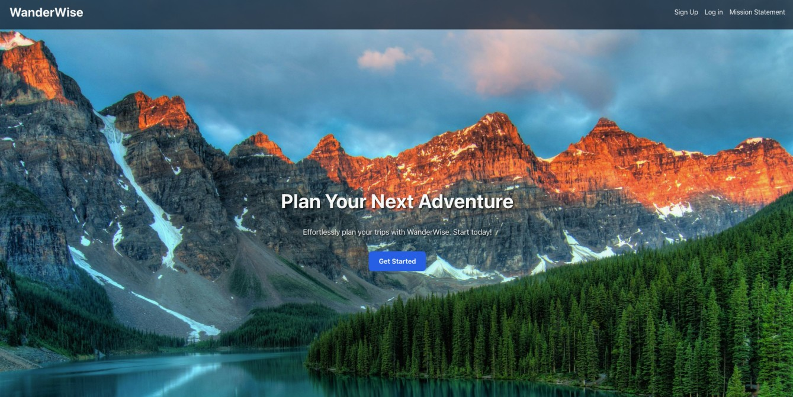
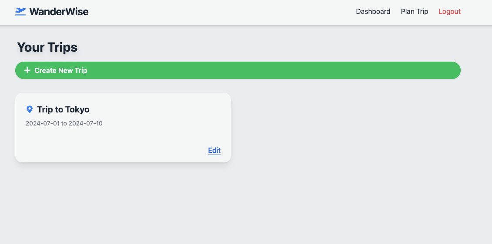
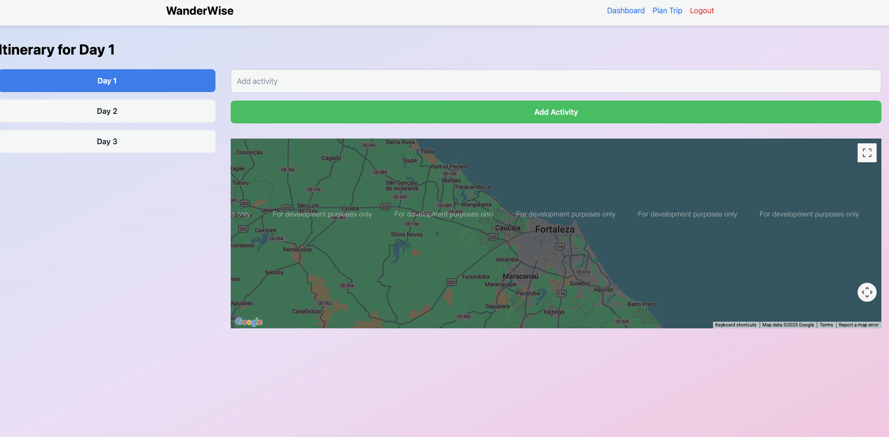

# WanderWise - Travel Planning Platform

WanderWise is a full-stack travel planning application that helps users create, manage, and share their travel itineraries. The platform combines a Django backend with a React frontend to provide a seamless travel planning experience.

## Tech Stack

### Backend
- Django (Python web framework)
- Django REST Framework (API development)
- SQLite (Database)

### Frontend
- React 18
- React Router DOM
- Google Maps API integration
- TailwindCSS for styling
- Axios for API requests

## Project Screenshots

### Home Page


### Dashboard


### Itinerary Planning



## New Project Structure

```
travel-planner/
├── backend/                # Django backend
│   ├── users/
│   ├── itineraries/
│   ├── travel_planner/
│   ├── db.sqlite3
│   ├── manage.py
│   ├── requirements.txt
│   └── README.md
├── frontend/               # React frontend
│   ├── public/
│   ├── src/
│   ├── package.json
│   ├── package-lock.json
│   └── tailwind.config.js
```

## Features

- User authentication and authorization
- Create and manage travel itineraries
- Interactive map integration using Google Maps API
- Responsive design with TailwindCSS
- RESTful API architecture

## Running the Project

### Backend
1. Navigate to the backend directory:
   ```bash
   cd backend
   ```
2. (Optional) Create and activate a virtual environment:
   ```bash
   python -m venv venv
   source venv/bin/activate  # On Windows: venv\Scripts\activate
   ```
3. Install dependencies:
   ```bash
   pip install -r requirements.txt
   ```
4. Run migrations:
   ```bash
   python manage.py migrate
   ```
5. Start the development server:
   ```bash
   python manage.py runserver
   ```

### Frontend
1. Open a new terminal and navigate to the frontend directory:
   ```bash
   cd frontend
   ```
2. Install dependencies:
   ```bash
   npm install
   ```
3. Start the development server:
   ```bash
   npm start
   ```

## Google Maps API Key Setup

To use the Google Maps integration, you must provide your own API key:

1. Create a file named `.env` in the root of your project (next to `package.json`).
2. Add the following line to the `.env` file:

   ```
   REACT_APP_GOOGLE_MAPS_API_KEY=your_actual_google_maps_api_key_here
   ```

3. Restart your React development server after saving the `.env` file.

You can obtain a Google Maps API key from the [Google Cloud Console](https://console.cloud.google.com/apis/credentials).

## API Endpoints

### Users
- `/api/users/` - User registration and management
- `/api/users/login/` - User authentication

### Itineraries
- `/api/itineraries/` - CRUD operations for travel itineraries
- `/api/itineraries/<id>/` - Individual itinerary management

## Contributing

1. Fork the repository
2. Create a feature branch
3. Commit your changes
4. Push to the branch
5. Create a Pull Request

## License

This project is licensed under the MIT License - see the LICENSE file for details.

